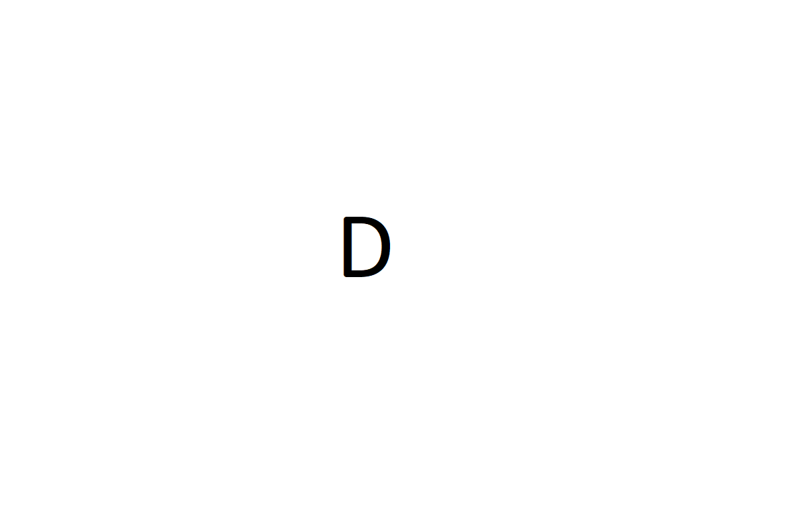

# Configuration 

## Module Configuration  

| Option                | Required | Description                              |
| --------------------- | -------- | -----------------------------------      |
| Name                  | **yes**  | Name of something                        |
| xxxx                  | **yes**  | Description of xxxx.                     |
| yyyy                  | no       | Description of yyyy                      |

## Reference Urls 

Some config references...

## Director Configuration  

If there is any configurtion inside of icinga director describe it here

